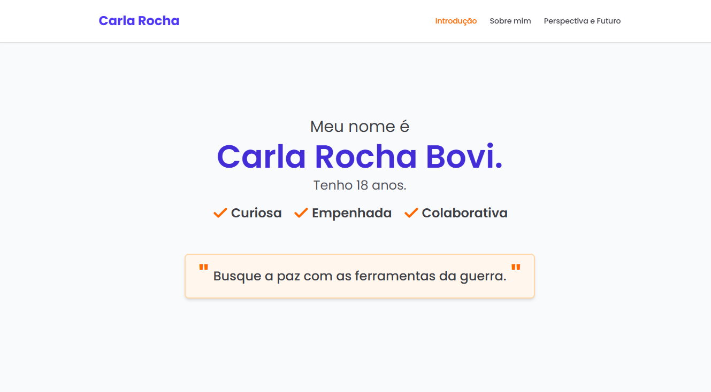

# Portfolio - Carla Rocha Bovi


## Screenshots



#### Responsive Design


## Sobre

Este é o meu portfolio pessoal, onde apresento minhas habilidades, interesses e perspectivas profissionais. Desenvolvido com foco em design limpo, moderno e responsivo, este site foi construído para mostrar meu trabalho e contar um pouco sobre mim.

---

## Tecnologias utilizadas

- **ReactJS** — Biblioteca JavaScript para construção da interface.
- **TailwindCSS** — Framework CSS para estilização rápida e responsiva.
- **Framer Motion** — Biblioteca para animações suaves e interativas.
- **Lucide Icons** — Ícones vetoriais leves e customizáveis.
- **Vite** — Ferramenta de build rápida para projetos front-end.

---

## Funcionalidades

- Navegação suave entre seções com destaque no menu conforme o usuário rola a página.
- Apresentação dinâmica de frases com animação.
- Seções sobre mim, interesses, família e perspectiva profissional.
- Design responsivo para ótima experiência em dispositivos móveis e desktop.
- Divisores com efeito visual suave para separar conteúdos.

---

## Como rodar o projeto localmente

1. Clone o repositório:

```bash
git clone https://github.com/seuusuario/seu-portfolio.git
```
2. Acesse a pasta do projeto:

```bash
cd portfolio
```
3. Instale as dependências:

```bash
npm install
```
4.Inicie o servidor de desenvolvimento

```bash
npm run dev
```
5. Abra no navegador:

Acesse http://localhost:5173 para visualizar o projeto em execução.

